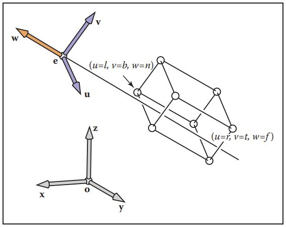
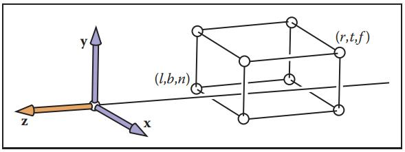
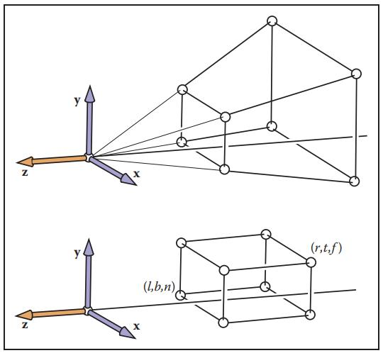
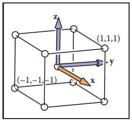

- 光栅化成像
- 几何表示
- 光的传播理论
- 动画与模拟

## 齐次坐标

Homogeneous coordinates

为了让平移的操作也能通过矩阵乘法来实现，这只能通过增加一维来实现

$(1,1,1)$的点，向$x+=1$、$y+=1$、$z+=1$的地方平移：
$$
\begin{bmatrix}
 1 & 0 & 0 & 1\\
 0 & 1 & 0 & 1\\
 0 & 0 & 1 & 1\\
 0 & 0 & 0 & 1
\end{bmatrix}

\begin{bmatrix}
 1 \\
 2 \\
 3 \\
 1 
\end{bmatrix}
=
\begin{bmatrix}
 2 \\
 3 \\
 4 \\
 1 
\end{bmatrix}
$$

$(x,y,z,w) == (\frac{x}{w},\frac{y}{w},\frac{z}{w},1)$

- If $w == 1$, then the vector $(x,y,z,1)$ is a point (position) in space.
- If $w == 0$, then the vector $(x,y,z,0)$ is a vector (direction).

## 变换

目的：把三维世界的点$p$，变换到二维屏幕上的点$p^\prime$（并带有深度信息）

变换矩阵 $M = M_{vp} M_{proj} M_{cam} M_{model}$

> Model View Projection简称MVP
>
> 其中M对应$M_{model}$，V对应$M_{cam}$，P对应$M_{proj}$
>
> <video src="./img/mvp.webm"></video>
>
> video copied from [Model View Projection](https://jsantell.com/model-view-projection/)

0. Model Transformation：在空间中通过各种变换矩阵$M_{model}$摆放物体

1. Camera Transformation：相机原先位于$\vec{e}=(e_x,e_y,e_z)$、看向$\hat{g}$、向上指向$\hat{t}$，通过变换$M_{cam}$把相机的坐标和方位规范化，变为位于原点、看向-Z、向上指向+Y。并将变换$M_{cam}$施加到世界中的所有物体上。

   

   先移动相机到原点，再旋转
   $$
   let\ \hat{p} = \hat{g} \times \hat{t}\\
   M_{cam} =
   \begin{bmatrix}
    \hat{p}_x & \hat{p}_y & \hat{p}_z & 0 \\
    \hat{t}_x & \hat{t}_y & \hat{t}_z & 0 \\
    -\hat{g}_x & -\hat{g}_y & -\hat{g}_z & 0 \\
    0 & 0 & 0 & 1
   \end{bmatrix} 
   
   \begin{bmatrix}
    1 & 0 & 0 & -e_x\\
    0 & 1 & 0 & -e_y\\
    0 & 0 & 1 & -e_z\\
    0 & 0 & 0 & 1
   \end{bmatrix}
   $$

2. Projection Transformation：通过变换$M_{proj}$把3D空间$[l,r]\times[b,t]\times[n,f]$压缩到原点的$[-1, 1]^3$规范空间内，xy轴保留着物体上下左右的关系，z轴保留了深度（远近）的信息

   

   - 正交投影 Orthographic Projection
     $$
     M_{proj} = M_{orth} =
     \begin{bmatrix}
      \frac{2}{r-l} & 0 & 0 & 0\\
      0 & \frac{2}{t-b} & 0 & 0\\
      0 & 0 & \frac{2}{n-f} & 0\\
      0 & 0 & 0 & 1
     \end{bmatrix}
     
     \begin{bmatrix}
      1 & 0 & 0 & -\frac{r+l}{2}\\
      0 & 1 & 0 & -\frac{t+b}{2}\\
      0 & 0 & 1 & -\frac{n+f}{2}\\
      0 & 0 & 0 & 1
     \end{bmatrix}
     \\
     =
     \begin{bmatrix}
      \frac{2}{r-l} & 0 & 0 & -\frac{r+l}{r-l}\\
      0 & \frac{2}{t-b} & 0 & -\frac{t+b}{t-b}\\
      0 & 0 & \frac{2}{n-f} & -\frac{n+f}{n-f}\\
      0 & 0 & 0 & 1
     \end{bmatrix}
     $$
     
   - 透视投影 Perspective Projection
     
     先把视锥压扁（也就是把所有切面都缩小到与近平面$z=n$等大，变成和正交投影初始状态一样的3D空间），然后再调用正交投影的变换矩阵
     
     
     $$
     M_{pers\to orth} =
     \begin{bmatrix}
      n & 0 & 0 & 0\\
      0 & n & 0 & 0\\
      0 & 0 & n+f & -nf\\
      0 & 0 & 1 & 0
     \end{bmatrix}
     \\
     M_{proj} = M_{orth} * M_{pers\to orth} = \\
     \begin{bmatrix}
      \frac{2}{r-l} & 0 & 0 & -\frac{r+l}{r-l}\\
      0 & \frac{2}{t-b} & 0 & -\frac{t+b}{t-b}\\
      0 & 0 & \frac{2}{n-f} & -\frac{n+f}{n-f}\\
      0 & 0 & 0 & 1
     \end{bmatrix}
     \begin{bmatrix}
      n & 0 & 0 & 0\\
      0 & n & 0 & 0\\
      0 & 0 & n+f & -nf\\
      0 & 0 & 1 & 0
     \end{bmatrix}
     $$
     
   
3. Viewport Transformation：通过变换$M_{vp}$，把规范空间3D空间$[-1, 1]^3$，拍摄为-Z方向的2D图像$[0, width]\times[0,height]$

   
   $$
   M_{vp} = 
   \begin{bmatrix}
    \frac{width}{2} & 0 & 0 & \frac{width}{2}\\
    0 & \frac{height}{2} & 0 & \frac{height}{2}\\
    0 & 0 & 1 & 0\\
    0 & 0 & 0 & 1
   \end{bmatrix}
   $$
   
   z轴的深度信息保留不变，在**光栅化**里才会用到

## 光栅化成像

**变换**后得到了许多带有深度信息的点，这些点两两之间可以构成线段，三三之间可以构成三角形

目的：计算出线段或三角形在屏幕上勾勒出的像素范围，利用深度信息区分出遮挡关系、着色❓

（可以物块颜色，绘制出遮挡关系了）

### 三角形的光栅化

一个个像素去采样

### 深度信息

z-buffer

### 抗锯齿

Anti Aliasing

- MSAA
- FSAA
- TAA

### 着色
